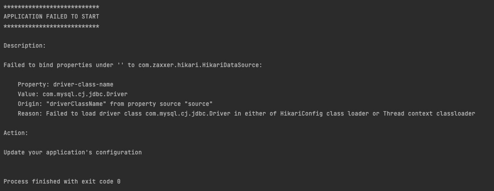
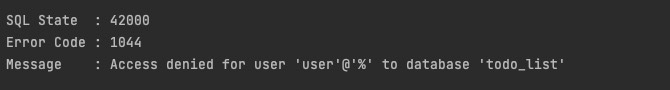
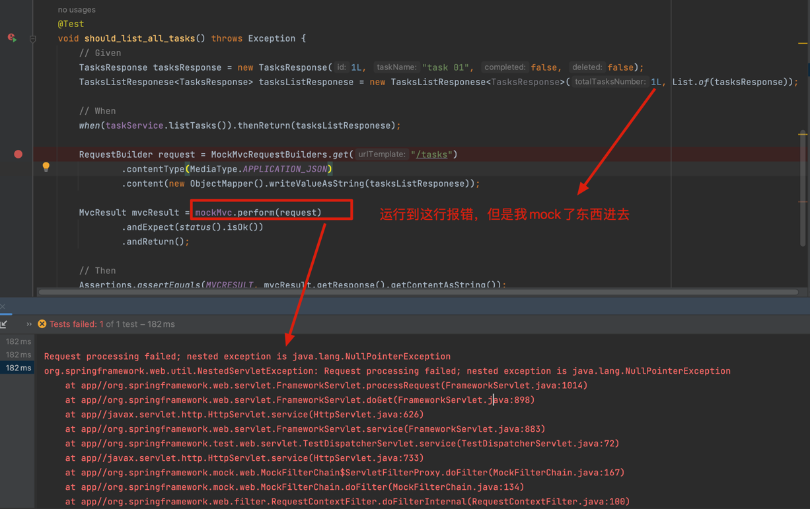

# 1.问题及解决办法
## 1.1未导入MySQL的drive依赖导致启动服务失败

### Q：


### A：
以下依赖导入失败：
    ```runtimeOnly("com.mysql:mysql-connector-j")```
更改为：
    ```implementation("mysql:mysql-connector-java:8.0.27")```

JPA可以理解是一个用来映射我写的**代码**和**数据库**的一个接口,但是启动连接数据库，是需要一个驱动的，所以需要导入一下这个驱动的依赖

如果想管理数据库数据 就可以导flyway

## 1.2 数据库中 user用户 无权限去访问todolist库

### Q：


### A：
需要用root用户登陆数据库，然后用root去修改user的权限
登陆root账户：```mysql -u root -p```，输入 root 账户密码,输入：

```
grant all privileges on todo_list.* to 'user'@'%' with grant option;
flush privileges;
```

grant：是一个和权限有关的命令；

all：代表给所有权限, 也可以是 insert, update 等等, all就是 增删改查 都可以给他权限；

on todo_list.* ：意思是todo_list这个schema里所有的表都给权限；

to 'user'@'%' ：代表给user这个用户, %代表所有端口；

flush privileges：刷新配置;

revoke：和grant是相反的 grant是给权限, revoke就是收权限。

## 1.3 因为 TaskService 注入失败导致测试失败
### Q：


### A:
造成错误的原因：

1. TaskController 未加 @AllArgsConstructor 注解，导致TaskService没有被注入
2. 测试中TaskService上写的注解是 @Mock 不是 @MockBean


# 2.Note

## 2.1 服务器运行起来的标志


## 2.2 查看端口占用情况
```
lsof -i tcp:3306
```


